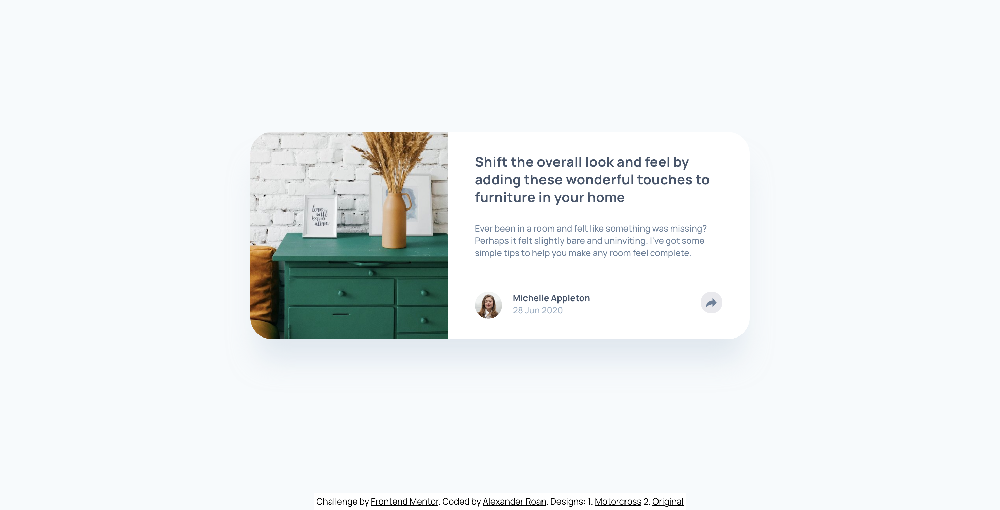

# Frontend Mentor - Article preview component solution

This is a solution to the [Article preview component challenge on Frontend Mentor](https://www.frontendmentor.io/challenges/article-preview-component-dYBN_pYFT). Frontend Mentor challenges help you improve your coding skills by building realistic projects. 

## Table of contents

- [Overview](#overview)
  - [The challenge](#the-challenge)
  - [Screenshot](#screenshot)
  - [Links](#links)
- [My process](#my-process)
  - [Built with](#built-with)
  - [What I learned](#what-i-learned)
  - [Continued development](#continued-development)
  - [Useful resources](#useful-resources)
- [Author](#author)
- [Acknowledgments](#acknowledgments)

## Overview

### The challenge

Users should be able to:

- View the optimal layout for the component depending on their device's screen size
- See the social media share links when they click the share icon

### Screenshot

### Links

- Solution URL: [Article Preview on FrontendMentor]()

- Live site - enduro design page: [Article preview - enduro](https://dearestalexander.github.io/fm-article-preview/index)
- Live site - original design page: [Article preview - original](https://dearestalexander.github.io/fm-article-preview/index-original)

## My process

### Built with

- Semantic HTML5 markup
- CSS custom properties
- Flexbox
- CSS Grid
- Mobile-first workflow

### What I learned

Before I start:

- I'm coming back to the challenges after a long break, so a bit apprehensive about how much HTML and CSS I've forgotten.
- Looking at the specification I expect the pop-up will be a challenge given the narrow vs. wide screen designs.
- I'm relatively comfortable with this level of JS, so I don't expect major issues.

As I've worked through this:

1) The main Struggle was with the pop-up position

Attempt 1

- I started with the pop up menu positioned in HTML below the share button
- The share button sits quite far down the hierarchy below the component
- This made positioning the pop-up menu for wide screens very easy as it appears next to the button
- However, this made it hard to re-size for mobile where it should stretch across the component width
  - (The component was a couple of levels up in the HTML hierarchy)

Attempt 2

- I thought perhaps the cleanest way to do it is to have two pop up menus in the HTML one for narrow screens, one for wide
- This worked well for positioning, by placing the pop up menus in HTML right next to the elements they position by
- However, I didn't like the JS which required changing visibility depending on screen size

Attempt 3 (final solution)

- In the end I positioned the pop up in HTML directly under the component
- This made the narrow screen position very easy
- To re-position for mobile does require using `position`, but it wasn't that difficult in the end.

2) I encountered a few issues with layering and visibility

- Just as I thought I was almost finished I noticed a problem with setting my component as `overflow: visible`
- I did this to allow the desktop pop-up to appear outside the right border of the component
- However this stopped my border-radius from working
- I figured out you could simply create an inner-wrapper for the component in HTMl and put anything you want `overflow: hidden` inside that

Other thoughts

I was thinking about whether classes should be HTML led or CSS led. What I mean for example is:

- HTML led class
  - Apply class in relation to the layout sections in HTML and their purpose
  - Then apply your styling 'in those classes'
  - So for example you might have a class like `.card-title`. You would then just set things like font inside that in CSS

- CSS led class
  - Instead create CSS classes based on the Figma spec
  - So you have class like `.text-preset-1`
  - You then add that class to the relevant HTML elements

I asked ChatGPT about this and it suggested both were feasible and depends on the scenario. That answer kind of makes sense. If a project build was focussed on communicating clearly with the designers it might be best to lead by CSS class according to design logic. Accepting that it might be harder to maintain / track/ interpret the HTML.

### Continued development

I did take this opportunity to experiment a bit and make my own design.

I was pleasantly surprised at how easy it is to take a component design and re-use it. In my own design I just put the cards inside a container and used flex on that. The wrapping seems to work fine. I was a bit concerned on the wrapping points because you have the individual cards wrapping, then you have the cards themselves switching from horizontal to verical orientation. I think in a real-life project it might be better to use grid than fflex on the container and set more specific rules.

### Useful resources

## Author

- Website - [Alexander Roan](https://www.alexroan.com)
- Frontend Mentor - [@dearestalexander](https://www.frontendmentor.io/profile/dearestalexander)
- Twitter - [@alexroanwrites](https://x.com/alexroanwrites)

## Acknowledgments

Appreciate the nuance of this design bringing in the different pop up styles as a chance to experiement and learn.